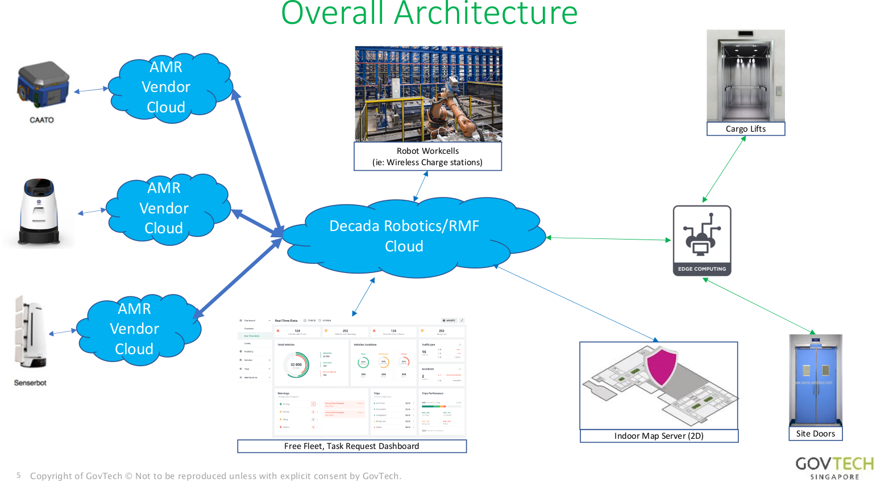

# Our mission and objectives

## Our mission

To standardize robot testing uniformly throughout the robotcs industry through varied real-life projects showcased here.

## Our Objectives

We wish to establish the following:
- Requirements and guidelines for
    - Robot to Robot Interactions
    - Robot to People Interactions
    - Robot to Facilities (E.g. Doors, lifts, wireless charging docks) Interactions and Integrations
- A sandbox for further studies
    - Vendor interoperability, vendor work relationships
    - Asset ownership (ie: Lift/door PLC devices)
    - Technical standards, validate standard interfaces
    - Operational safety and reliability concerns
    - Policy considerations

## Objectives -> Outcomes

Requirements:
- Operational Safety & reliability
- Standard interfaces validation
- User experience

Test Centric Approach:
- Nominal case testing
- corner case testing (Randomized testing)
- Exceptional case handling (SIS)

Readiness Assessment:
- Remote/Unsupervised operations
- "Many AMRs to One operator" operations
- Increased AMR operations frequencies

