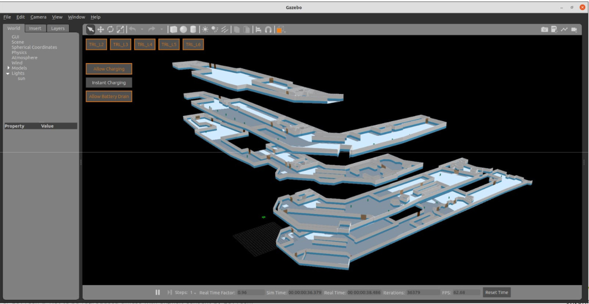

# Current Status

- Contractual matters
    - ITT documents published, awaiting evaluation (Mar 2022)
    - Direct contract awarded to Fujitec cargo lift (Mar +3mths)
    - AWS GCC cloud service setup

- Site Assessments
    - Cargo lift assessment completed – lift gap considerations, integration with Fujitec
    - Door assessments completed – Fire safety, security company (Bosch), 3 possible approaches

- Design Efforts / Documentations
    - RMF Safety Instrumented System (SIS)

- Current Developmental efforts
    - RMF hosted on AWS GCC; integrated with Caato
    - TRL levels 2-6 physically mapped, simulation and standalone scenarios done
    - Caato 2.0 built, I2R navigation stack installed and working
    - Network wiring arrangements (by NLB-TRL) underway

- Staging of Component Purchases
    - 1x Xnergy briefcase stand, 1set Phoenix Tx Rx Charger
    - 1x Dormakaba automatic door actuators
    - Parasoft Software QA license purchased
    - Beckhoff Programable Logic Controllers (PLC) for Lift
    - Decada Edge (Dell Edge) device purchase
    
# Virtual TRL (ROS-Gazebo)

