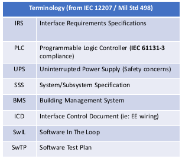
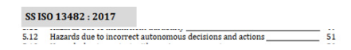

# Design Efforts

## Design Efforts / Document tree
- RMF BMS Systems Integrator (HT)
    - Lift acceptance test plan - from OEM
    - Lift PLC + lift acceptance test plan (include fire safety, PLC-UPS design), ICD
    - Lift PLC to Edge Computer test plan and IRS
    - Door PLC + Door acceptance test plan (include fire safety, PLC-UPS design)
    - Door PLC to Edge Computer test plan and IRS
    - Wireless Charger standardized docking test plan and IRS
- Overall RMF integrator (HT + Govtech)
    - Hazards and Risk analysis document, Risk Management Plan
        - Platform Safety
        - Operational Safety (ie: Fire safety)
    - Building Wiring ICD
    -  Network HDD and ICD
    -  Overall SSS, Systems design document
    -  Nominal case test plan (AMR vendors, basic 4 scenarios)
    -  Extended test plan (4 scenarios + emergency scenarios, Monte Carlo testing)
    -  Testing and commissioning plan
        - With ROS-Gazebo software in the loop (SwIL), SwTP for verification and validation
        - On Site Acceptance Test (OSAT)
- RMF Core integrator (OSRC + Senserbot)
    -RMF core cloud deployment SSS, Systems Design Document
    - RMF to BMS “cloud to cloud” test plan and IRS
    - Cybersecurity Risk Assessment (IM8, AIAS) & development plan
    - Software Quality (ie: Parasoft C++) where applicable
- Aurora-Caato developer (Senserbot + I2R + Govtech)
    - RMF Nominal + I2R integration requirements
- AMR Vendors (Lionsbot? Gaussian..?)
    - RMF Nominal case integration requirements (to be discussed)

<!--- -->

    

## Design Efforts / Documentation Goals:

- Identify updated type "C" requirements (ie: complimentary to ISO-
13482 as an operational standard) covering indoor buildings and
RMF-like system
    - *Complimentary to I2R efforts to update ISO/TC299, ISO/CD 18646-2

<!--- -->

    

- Update to IMDA AMR guidelines (ie: Govt Playbook)