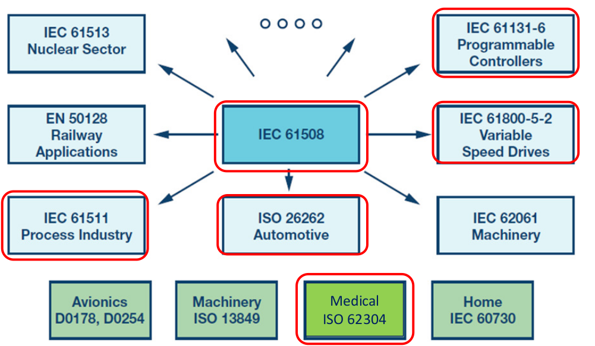
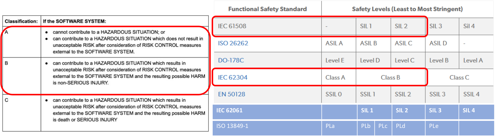
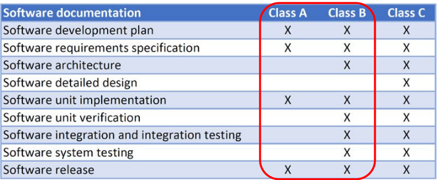
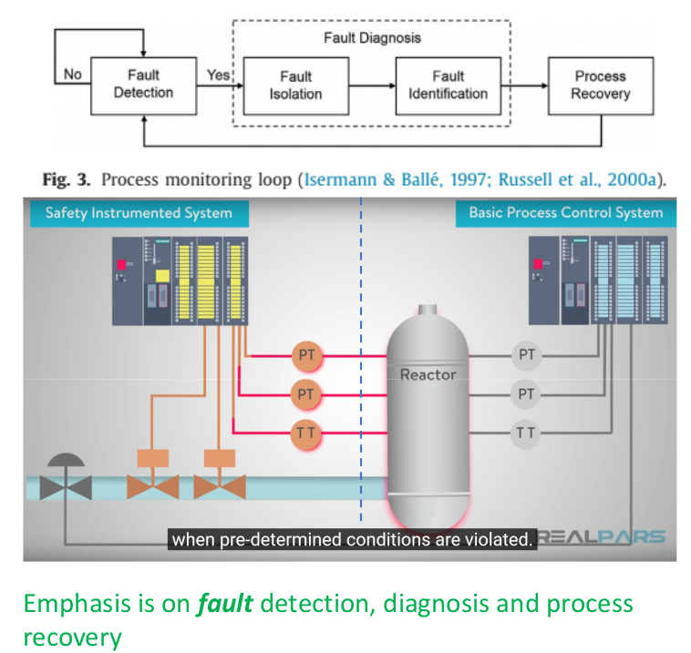
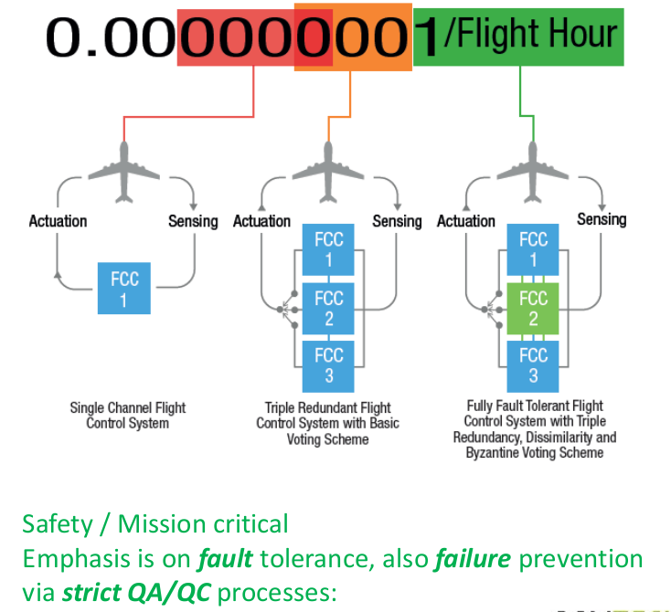

# Risk Assessment

## Many forms of Functional Safety (IEC 61508)

## Approach to Risk Assessment & Hazards Analysis

- Classifications (Mix of IEC 62304 and IEC 61508 SIL definitions):
    - Class A: No injury or damage to health is possible.
    - Class B: Injury is possible, but not serious.
    - Class C: Death or serious injury is possible.

## Approach to Software Systems Safety (ISO 62304)

# Difference in Class

### Class B

### VS Class C/ Lvl A/ SIL 4

