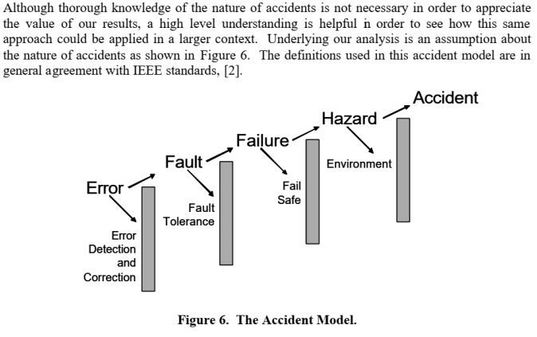

# Terms of Reference

 - A **disturbance/error** is an unknown and uncontrolled input acting on a system.
 - A **fault** is an unpermitted deviation of at least one characteristic property or parameter of the system from
the acceptable/usual/standard operating conditions.
 - A **failure** is a permanent
interruption of a system’s ability to perform a required function
under specified operating conditions.
 - Traditional control systems
are designed to return the system to normal operations in the
presence of disturbances but not in the presence of faults or failures.
 - **Fault-tolerant control** (FTC) systems refer to control systems
that have been designed to explicitly account for some class of
specified faults in the closed-loop system. FTC systems must act
in the time between a fault and a system failure.

### The Nature of Accidents

