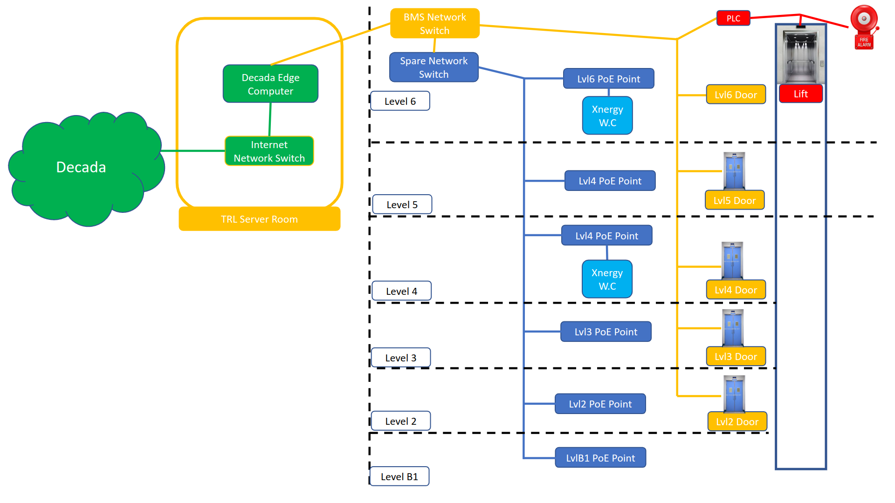
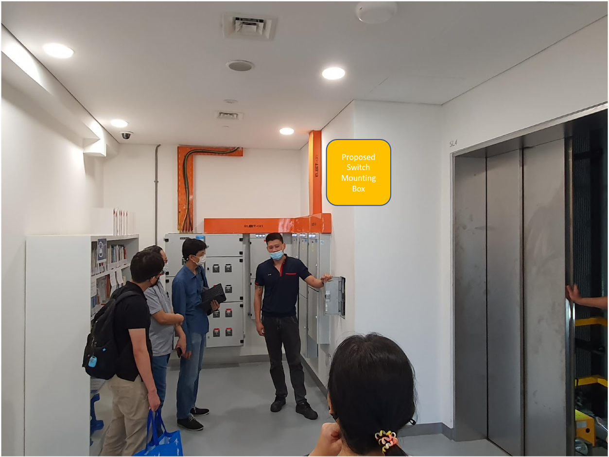
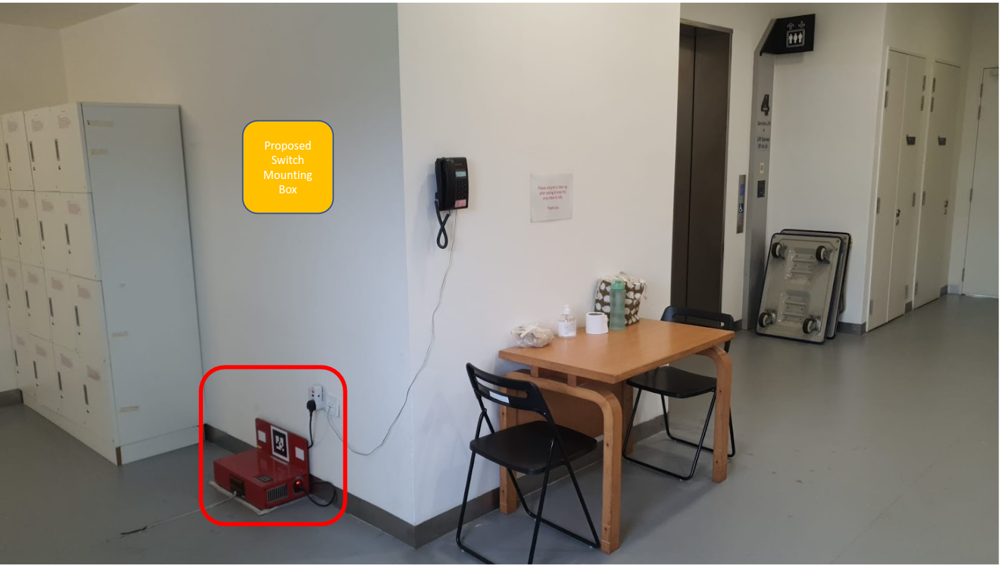
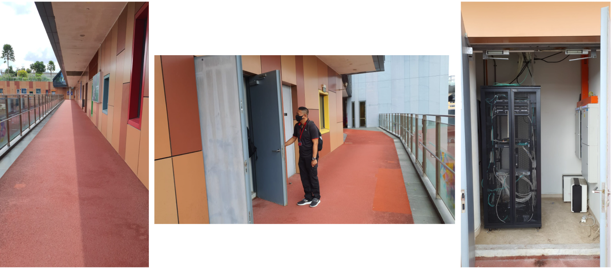
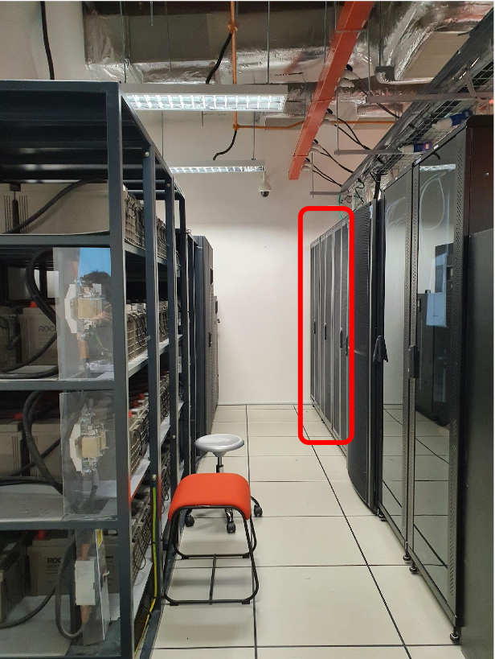

# Ethernet wiring diagram at TRL

## Wiring Requiurements

- Lvl B1 – x1 Eth Port (no auto doors, 1 for spare)
- Lvl 2-5 – x2 Eth Port each (1 for door, 1 for spare)
- Lvl 6 – x4 Eth Port (1 for door, 1 for spare) 
- (Lift PLC to have x2 lan cables for redundancy)

Wireless charger to deploy at level 4 and 6

### Level 6

### Level 4

### Trunking switch to Server room

### Server room

